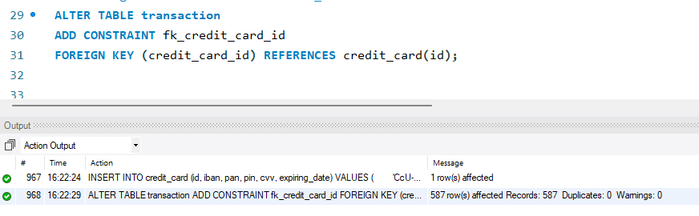
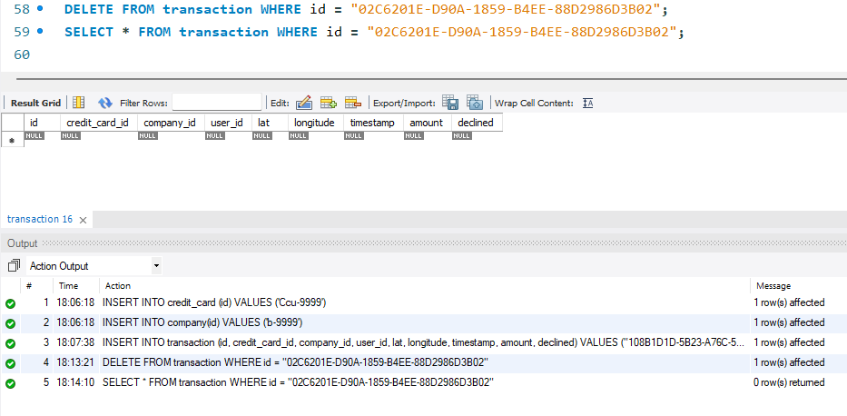

# Sprint 3 - Nivel 1

## Exercici 1
1. La teva tasca és dissenyar i crear una taula anomenada "credit_card" que emmagatzemi detalls crucials sobre les targetes de crèdit. 
2. La nova taula ha de ser capaç d'identificar de manera única cada targeta i establir una relació adequada amb les altres dues taules ("transaction" i "company"). 
3. Després de crear la taula serà necessari que ingressis la informació del document denominat "dades_introduir_credit". 
4. Recorda mostrar el diagrama i realitzar una breu descripció d'aquest.

### Respuestas:

1. Creo la tabla llamada denominada "credit_card", identificando a ***id*** como PRIMARY KEY


2. identifico las primary key de todas las tablas: 
   
|   Table   |transaction|company|credit_card|
|       -   |    -      |   -   |    -      |
|Primary Key|    id     |   id  |    id     |

2. Realizo un CREATE INDEX para transaction para poder generar posteriormente los foreing key.
   


3. Agrego los datos de "dades_introduir_credit" a la credit_card segun lo indicado:


4. Realizo un Alter table para identificar las relaciones con las tablas        
**transaction** -**credit_card**




5. Finalmente obtengo la relacion de las tres tablas: 


Relaciones:
- En el caso de company y transaction la relación en 1:N, esto debido a que es posible que una misma compania tenga varias transacciones asociadas. Lo mismo pasa con credit_card y transation, ya que una misma tarjeta puede terner asociadas varias transacciones.


## Exercici 2
El departament de Recursos Humans ha identificat un error en el número de compte de l'usuari amb ID CcU-2938. La informació que ha de mostrar-se per a aquest registre és: R323456312213576817699999. Recorda mostrar que el canvi es va realitzar.


### Paso 1

Voy a identificar el dato mediante el comando:
```sql
SELECT id, iban  FROM credit_card WHERE id = "CcU-2938";
```
El output es:


### Paso 2
Ahora reemplazo a traves del siguiente comando: 

```sql
update credit_card 
set iban = 'TR323456312213576817699999' 
where id = "CcU-2938";
```
Realizo la comprobación mediante el mismo codigo del paso 1

```sql
SELECT id, iban  FROM credit_card WHERE id = "CcU-2938";
```
El output es el siguiente: 


## Exercici 3
En la taula "transaction" ingressa un nou usuari amb la següent informació:     
| campo           | data                                |
|-----------------|-------------------------------------|
| Id              | 108B1D1D-5B23-A76C-55EF-C568E49A99DD |
| credit_card_id  | CcU-9999                            |
| company_id      | b-9999                              |
| user_id         | 9999                                |
| lat             | 829.999                             |
| longitude       | -117.999                            |
| amount          | 111.11                              |
| declined        | 0                                   |


1. El primer paso es agregar la información en la tabla company y credit_card. Para ello primero quito el NOT NULL de los campos de credit_card para insertar los datos:


2. Inserto los datos en credit_card y company previo a hacerlo en transaction:


3. Inserto los datos en transaction. Como no se entrega una fecha, genero una fecha en ese lugar mediante NOW()


## Exercici 4
Des de recursos humans et sol·liciten eliminar la columna "pan" de la taula credit_card. Recorda mostrar el canvi realitzat.
```sql
alter table credit_card drop column pan;
```
El resultado es el siguiente:

En este output vemos como el campo "pan" ya no esta en la tabla _**credit_card**_


# Sprint 3 - Nivel 2

## Exercici 1

Elimina de la taula transaction el registre amb ID 02C6201E-D90A-1859-B4EE-88D2986D3B02 de la base de dades



## Exercici 2

Serà necessària que creïs una vista anomenada VistaMarketing 
```sql
CREATE VIEW VistaMarketing AS 
SELECT company_name, phone, country, round(avg(amount), 2) as Mitjana
FROM company
JOIN transaction
ON transaction.company_id = company.id
GROUP BY company_name, phone, country
ORDER BY mitjana desc;
```
Para mostrar la vista, puedo usar el siguiente comando:
```sql
SELECT * FROM VistaMarketing;
```
Tambien es posible ver la vista desde el panel de "schema"


## Exercici 3

Filtra la vista VistaMarketing per a mostrar només les companyies que tenen el seu país de residència en "Germany"

```sql
SELECT * FROM VistaMarketing
WHERE country = 'Germany';
```

La tabla entregada es: 


# Sprint 3 - Nivell 3


1. Creo la tabla y el index indicado en el archivo


2. Agrego los datos, pero genera el siguiente error:


3. Corrigo la relación de las constrain quitando el foreing key de la tabla user. Para ello lo primero es borra la tabla (DROP TABLE) y posteriormente crearla nuevamente.


1. Agrego los datos


5. El diagrama es: 


## Exercici 1

La setmana vinent tindràs una nova reunió amb els gerents de màrqueting. Un company del teu equip va realitzar modificacions en la base de dades, però no recorda com les va realitzar. 

En rojo indico las diferencias entre la tabla obtenida y la tabla entregada.


Estos son aguos cambios:
| # | Tabla         | Descripción del Cambio                    | Comando Utilizado                             |
|---|---------------|-------------------------------------------|-----------------------------------------------|
| 1 | credit_card   | Agrega "fecha_actual" de tipo DATE        | ALTER TABLE credit_card ADD fecha_actual DATE;|
| 2 | company       | Elimina "website"                         | ALTER TABLE company DROP COLUMN website;      |
| 3 | credit_card   | Cambia tipo de "cvv" de VARCHAR a INT     | ALTER TABLE credit_card MODIFY cvv INT;       |
| 4 | user          | cambiar el nombre del campo               | ALTER TABLE user CHANGE email personal_mail   |
| 5 | user          | cambiar el nombre de tabla                | ALTER TABLE user RENAME TO data_user          | 


## Exercici 2
L'empresa també et sol·licita crear una vista anomenada "InformeTecnico" que contingui la següent informació:

ID de la transacció
Nom de l'usuari/ària
Cognom de l'usuari/ària
IBAN de la targeta de crèdit usada.
Nom de la companyia de la transacció realitzada.
Assegura't d'incloure informació rellevant de totes dues taules i utilitza àlies per a canviar de nom columnes segons sigui necessari.
Mostra els resultats de la vista, ordena els resultats de manera descendent en funció de la variable ID de transaction.


