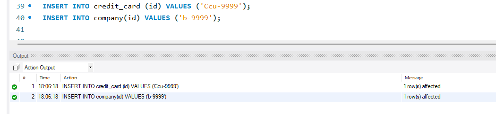
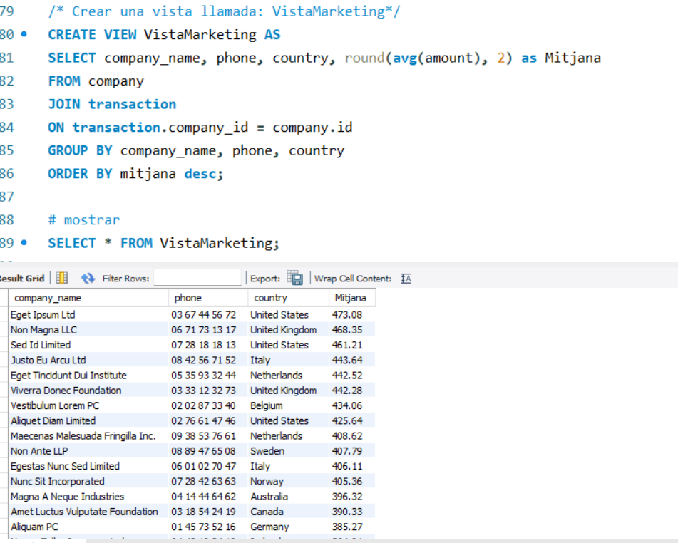
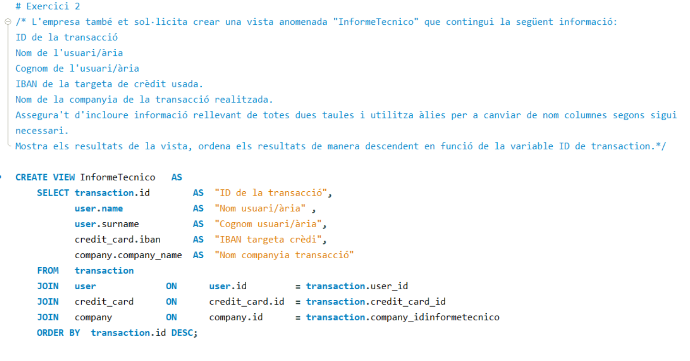
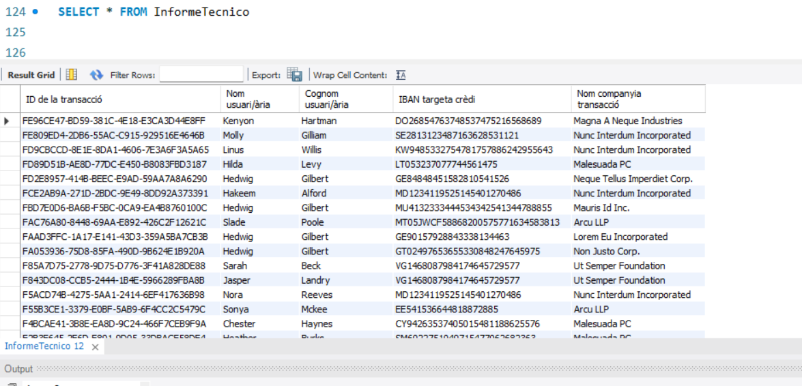

# Sprint 3 - Nivel 1

## Exercici 1

### Diseño de tabla

En primer lugar, debo crear la tabla _**user**_ con los respectivos datos entregados: 

| Field          | Type          | Key  | 
|----------------|---------------|------|
| id             |  varchar(10)  |  PK  |  
| iban           |  varchar(30)  |      |
| pan            |  varchar(15)  |      |
| pin            |  varchar(10)  |      |
| cvv            |  varchar(5)   |      |
| expiring_date  |  date         |      |

El codigo de creación de la tabla es el siguiente: 

```sql
CREATE TABLE credit_card (
    id   	 varchar(10) PRIMARY KEY, # Defino la PK
    iban 	 varchar(30),
    pan 	 varchar(15),
    pin 	 varchar(10),
    cvv 	 varchar(5),
    expiring_date date );
```
La nueva tabla debe ser capaz de identificar de forma única cada tarjeta y establecer una relación adecuada con las otras dos tablas ("transaction" y "company"). 


### Observaciones: 
1. En _**transaction**_ tengo el dato de credit_card_id, a traves de esto puedo generar una tabla que me permita tener un id unico para relacionar los datos 

2. La relación entre las tablas  user, credit_card, company es de 1:n respecto a transaction.


## Exercici 2
El departament de Recursos Humans ha identificat un error en el número de compte de l'usuari amb el:
- IBAN CcU-2938. 
- Es requereix actualitzar la informació que identifica un compte bancari a nivell internacional (identificat com 
-"IBAN"): TR323456312213576817699999. 
### Paso 1
Voy a identificar el dato mediante el comando:
```sql
SELECT id, iban  FROM credit_card WHERE id = "CcU-2938";
```
El output es:


### Paso 2
Ahora reemplazo a traves del siguiente comando: 

```sql
update credit_card 
set iban = 'TR323456312213576817699999' 
where id = "CcU-2938";
```
Realizo la comprobación mediante el mismo codigo del paso 1

```sql
SELECT id, iban  FROM credit_card WHERE id = "CcU-2938";
```
El output es el siguiente: 


## Exercici 3

En la taula "transaction" ingressa un nou usuari amb la següent informació:

### Paso 1: 
Verificar los campos de la tabla transaccion para generar el comando de insertar:

```sql
SHOW COLUMNS FROM transaction;
```


### Paso 2:  

Para ingresar lo que pide el enunciado debo utilizar este codigo:
```sql
INSERT INTO transaction(id, credit_card_id, company_id, user_id, lat, longitude, timestamp, amount, declined)
VALUES ("108B1D1D-5B23-A76C-55EF-C568E49A99DD", "CcU-9999", "b-9999", 9999, 829.999, -117.999, NOW(), 111.11, 0);
```
Sin embargo, antes de utlizarlo debo insertar el valor de b-9999 en la tabla de company, ya que esta esta relacionada con transaction
```sql
INSERT INTO company(id) VALUES ('b-9999');
```

### Ahora ingreso el valor en la tabla

```sql
INSERT INTO transaction(id, credit_card_id, company_id, user_id, lat, longitude, timestamp, amount, declined)
VALUES ("108B1D1D-5B23-A76C-55EF-C568E49A99DD", "CcU-9999", "b-9999", 9999, 829.999, -117.999, NOW(), 111.11, 0);
```
### Reviso que efectivamente se ha hecho bien:
```sql
select * from transaction
where id ="108B1D1D-5B23-A76C-55EF-C568E49A99DD"
```
EL OUTPUT ES:




## Exercici 4

Des de recursos humans et sol·liciten eliminar la columna "pan" de la taula credit_card. Recorda mostrar el canvi realitzat.

```sql
alter table credit_card drop column pan;
```
El resultado es el siguiente:


En este output vemos como el campo "pan" ya no esta en la tabla _**credit_card**_

# Sprint 3 - Nivel 2

## Exercici 1
- Elimina de la taula transaction el registre amb ID 02C6201E-D90A-1859-B4EE-88D2986D3B02 de la base de dades

```sql
DELETE FROM transation where id = "02C6201E-D90A-1859-B4EE-88D2986D3B02";
```
Al alplicar este código, el sistema devuelve el siguiente error: 
```
Error Code: 1451. Cannot delete or update a parent row: a foreign key constraint fails (`transactions`.`user`, CONSTRAINT `user_ibfk_1` FOREIGN KEY (`id`) REFERENCES `transaction` (`user_id`))
```
Para ello puedo borrar el dato primero de user y despues de transaction: Esto lo puedo haer mediante una subquery:
```sql
DELETE FROM user 
WHERE   id = (
    SELECT user_id 
    FROM transaction 
    WHERE id = '02C6201E-D90A-1859-B4EE-88D2986D3B02');
# una vez hecho esto puedo eliminar el dato segùn lo solicitado:
DELETE FROM transaction WHERE id = '02C6201E-D90A-1859-B4EE-88D2986D3B02';
```


## Exercici 2

Serà necessària que creïs una vista anomenada VistaMarketing 

```sql
CREATE VIEW VistaMarketing AS 
SELECT company_name, phone, country, round(avg(amount), 2) as Mitjana
FROM company
JOIN transaction
ON transaction.company_id = company.id
GROUP BY company_name, phone, country
ORDER BY mitjana desc;
```

Para mostrar la vista, puedo usar el siguiente comando:
```sql
SELECT * FROM VistaMarketing;
```

Tambien es posible ver la vista desde el panel de "schema"




## Exercici 3

Filtra la vista VistaMarketing per a mostrar només les companyies que tenen el seu país de residència en "Germany"

```sql
SELECT * FROM VistaMarketing
WHERE country = 'Germany';
```

La tabla entregada es: 


# Sprint 3 - Nivell 3

## Exercici 1

La próxima semana tendrás una nueva reunión con los gerentes de marketing. Un compañero de tu equipo realizó modificaciones en la base de datos, pero no recuerda cómo las hizo. 


| n | tabla         | Descripcion cambio                                         | Comando utilizado                                            |
|---|---------------|------------------------------------------------------------|--------------------------------------------------------------|
| 1 | credit_card   | Agregado un campo llamado _fecha_actual_ tipo **date**     | ```ALTER TABLE credit_card ADD fecha_actual DATE; ```        |
| 2 | company       | Elimina el campo **website**                               | ```ALTER TABLE company DROP COLUMN website;```               |
| 3 | credit_card   | Cambia  tipo de variable de _cvv_ de **varchar** a **int** |```ALTER TABLE alter table credit_Card modify cvv int```


## Exercici 2


